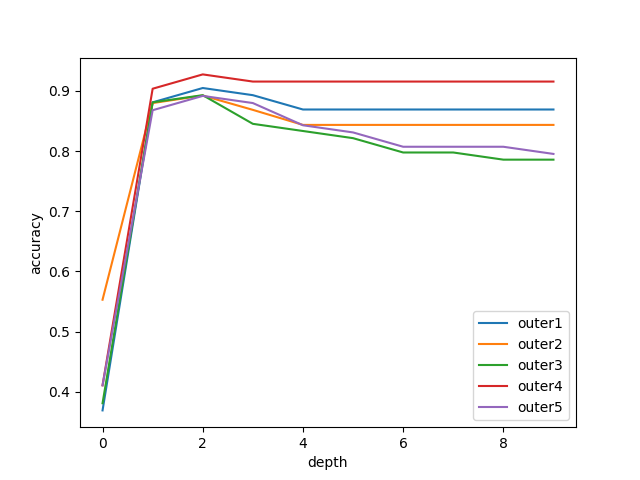

Generated data using the follwoing code:

```python:
from sklearn.datasets import make_classification
    X, y = make_classification(
    n_features=2, n_redundant=0, n_informative=2, random_state=1, n_clusters_per_class=2, class_sep=0.5)

    # For plotting
    import matplotlib.pyplot as plt
    plt.scatter(X[:, 0], X[:, 1], c=y)
```
The first 70% of the data is used for training and remainig 30% is used for testing.\
Upon fitting and pfredicting using the implementation in `question_1`, the outputs are a follows:
```
Criteria : information_gain
----->Training Accuracy:  1.0
----->Testing Accuracy:  0.9
Class = 0
----->Precision:  0.9090909090909091
----->Recall:  0.8333333333333334
Class = 1
----->Precision:  0.8947368421052632
----->Recall:  0.9444444444444444
```
```
Criteria : gini_index
----->Training Accuracy:  1.0
----->Testing Accuracy:  0.9
Class = 0
----->Precision:  0.9090909090909091
----->Recall:  0.8333333333333334
Class = 1
----->Precision:  0.8947368421052632
----->Recall:  0.9444444444444444
```
Implemented 5 fold cross validation and the average accuracy obtained is 0.8844117647058823

Applied nested cross validation with
    Outer fold: 5 
    Inner fold: 4
    depths varying from 0 to 9
    to find the optimal depth

Results for all the folds:
```
    Accuracy for outer fold 1: 0.9375 depth: 2
    Accuracy for outer fold 2: 0.8823529411764706 depth: 2
    Accuracy for outer fold 3: 1.0 depth: 2
    Accuracy for outer fold 4: 0.7647058823529411 depth: 2
    Accuracy for outer fold 5: 0.9411764705882353 depth: 2
    Optimal Depth: 2
```

The plot for the depth vs accuracy:

