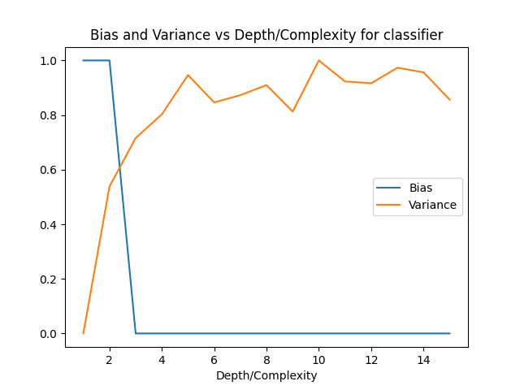
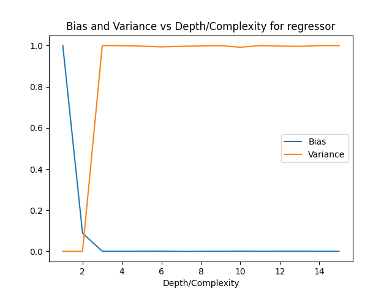

The bias and variance vs complexity (depth) is calculated and plot is plotted for Classification and Regression Dataset.

Data has been generated in the following ways:

For Regression:
```python:
x = np.linspace(0, 10, 50)
eps = np.random.normal(0, 5, 50)
```
For Classifiction:
```python:
X, y = make_classification(n_features=2, n_redundant=0, n_informative=2, random_state=1,n_clusters_per_class=2, class_sep=0.5)
```
The above datasets are boostrapped for over 100 times and run to calculate the Bias and Variance.
So, on total 100 models are constructed.

Tha calculation of Bias and Variance has been referred from [here](http://rasbt.github.io/mlxtend/user_guide/evaluate/bias_variance_decomp/)

Depths varied from 1 to 15 and the results are as follows:

Values:

```
Regression:
for depth 1
Bias: 1840.508723881195
Variance: 1.934665592836427e-27
for depth 2
Bias: 823.5235747954886
Variance: 2.0194839173657902e-28
for depth 3
Bias: 725.0602867096626
Variance: 0.34932794617315055
for depth 4
Bias: 724.8303046442213
Variance: 0.34922313730841203
for depth 5
Bias: 725.3679076796551
Variance: 0.3484894752552431
for depth 6
Bias: 725.5993570692029
Variance: 0.3471269600136437
for depth 7
Bias: 724.5246401063704
Variance: 0.3481051760845356
for depth 8
Bias: 724.6773326301429
Variance: 0.3488039018494584
for depth 9
Bias: 724.8303046442213
Variance: 0.3492231373084121
for depth 10
Bias: 725.6766466108718
Variance: 0.3465330431134592
for depth 11
Bias: 724.9068954601254
Variance: 0.3493279461731505
for depth 12
Bias: 725.3679076796553
Variance: 0.34848947525524315
for depth 13
Bias: 725.4449876035945
Variance: 0.3481051760845356
for depth 14
Bias: 724.9835561486057
Variance: 0.34936288246139663
for depth 15
Bias: 724.9068954601254
Variance: 0.3493279461731505
Classification:
for depth 1
Bias: 0.06666666666666667
Variance: 0.01983333333333333
for depth 2
Bias: 0.06666666666666667
Variance: 0.046666666666666676
for depth 3
Bias: 0.03333333333333333
Variance: 0.055499999999999994
for depth 4
Bias: 0.03333333333333333
Variance: 0.05983333333333332
for depth 5
Bias: 0.03333333333333333
Variance: 0.06699999999999999
for depth 6
Bias: 0.03333333333333333
Variance: 0.06200000000000001
for depth 7
Bias: 0.03333333333333333
Variance: 0.06333333333333334
for depth 8
Bias: 0.03333333333333333
Variance: 0.06516666666666666
for depth 9
Bias: 0.03333333333333333
Variance: 0.060333333333333336
for depth 10
Bias: 0.03333333333333333
Variance: 0.06966666666666667
for depth 11
Bias: 0.03333333333333333
Variance: 0.06583333333333334
for depth 12
Bias: 0.03333333333333333
Variance: 0.0655
for depth 13
Bias: 0.03333333333333333
Variance: 0.06833333333333333
for depth 14
Bias: 0.03333333333333333
Variance: 0.06749999999999999
for depth 15
Bias: 0.03333333333333333
Variance: 0.0625

```

Classification:



Regression:

