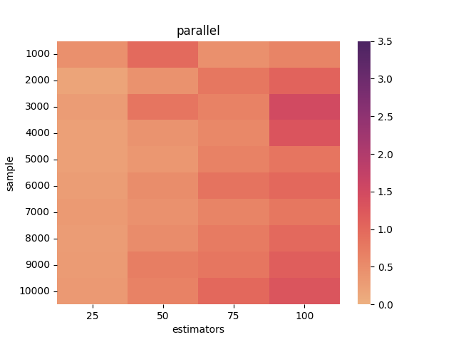

## Q4 .a
Bagging has been implemneted and tested using `q4_Bagging.py`\
The following are the results:
```
Accuracy:  0.982
Regular Implementation(time) for n_jobs = single:  0.027665200002957135
Accuracy:  0.992
Parallel Implementation(time) for n_jobs = parallel:  0.019954799965489656
```

The plots are as follows:\
Individual Estimators


Common Decision Boundaries


## Q4 .b
Bagging ensemble is developed using sklearn. An extra parameter named `n_jobs` has been introduced which takes `single` and `parallel` as inputs, dafault being `single`.

When the n_jobs is single, the bargging is implemented generally else it is run parallel.

The notebook has been created for experimentation purpose for timing analysis for different values of estimators and sample. 

The plots for regular implementation is as follows:

Regular:


Parallel:



The times of pivot for estimators and samples is as follows:
Single:
```
estimators       25        50        75        100
sample                                            
1000        0.275211  0.905736  0.655440  0.696580
2000        0.211136  0.497851  0.757279  1.439289
3000        0.494159  0.598375  1.476154  1.675020
4000        0.515755  0.659772  1.067336  1.370335
5000        0.429337  0.754182  1.066853  1.333724
6000        0.487374  0.978400  1.677496  2.257897
7000        0.652849  0.868277  1.233490  1.555273
8000        0.520621  1.037377  1.549167  2.029958
9000        0.689364  1.338052  1.760678  2.287055
10000       0.715258  1.398376  2.122683  3.147686
```
Parallel:
```
estimators       25        50        75        100
sample                                            
1000        0.458783  0.982128  0.463101  0.621967
2000        0.170430  0.432043  0.797911  1.076794
3000        0.274827  0.822141  0.645987  1.498044
4000        0.229397  0.416870  0.561651  1.312053
5000        0.228159  0.367019  0.654002  0.828925
6000        0.265900  0.500342  0.850410  1.005377
7000        0.305123  0.448113  0.616619  0.793087
8000        0.274686  0.511482  0.743937  0.995448
9000        0.290108  0.697504  0.809122  1.148925
10000       0.327725  0.653984  1.003177  1.285545
```

So, we can see that as number of estimators increase or number of samples or both increase, time taken in parallel is less than regular implmentation whereas for smaller values time for regular is less than parallel.
Reason is due to context switches.