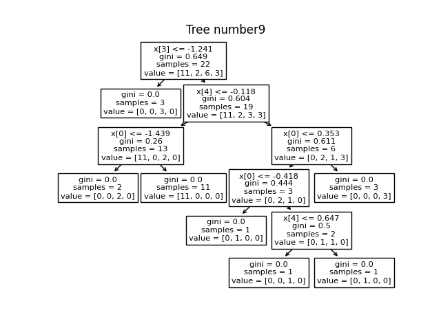

## Q5. a
Random forest is implemented using sklearn Decision trees and is updated in `tree/randomForest.py`

The implementation is tested against `q5_RandomForest.py` and the results are as follows:
```
Classification:
Accuracy:  0.8666666666666667
Class: 0
Precision:  0.8181818181818182
Recall:  1.0
Class: 3
Precision:  1.0
Recall:  0.8571428571428571
Class: 2
Precision:  0.8571428571428571
Recall:  0.8571428571428571
Class: 4
Precision:  0.75
Recall:  0.75
Class: 1
Precision:  1.0
Recall:  0.6666666666666666
Regression:
RMSE:  0.4290754334638863
MAE:  0.3110980702359378
```
So, the implementation is correct as the accuracy is ~86 in classification and rmse is 0.42 for regression.

The plots of trees are as follows:

Classification:




Regression:


## Q5. b
Classification data iris data is taken for plotting random forest. Two features are drawn for each decision surface and plots are as follows:

The features are taken as follows :

Petal length and Petal Width:


Sepal length and Petal length:


Sepal length and Sepal Width:


