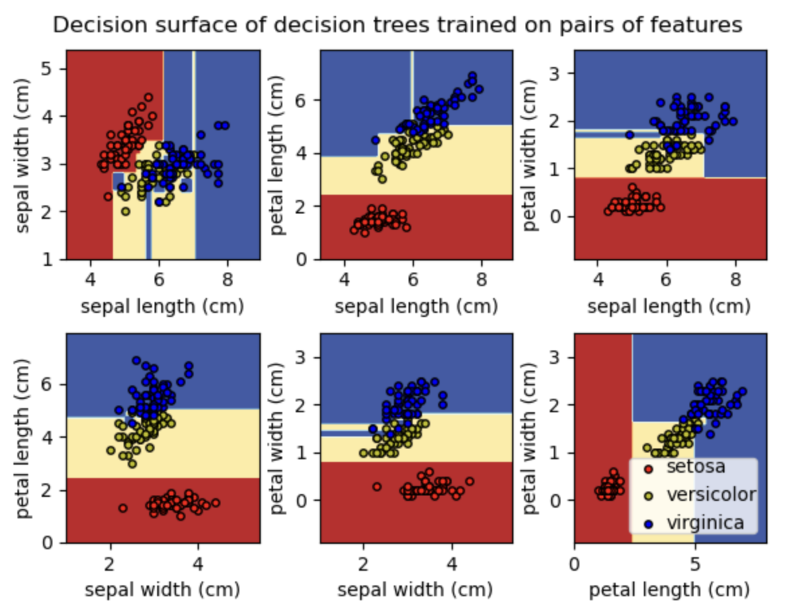

[](https://classroom.github.com/online_ide?assignment_repo_id=9954024&assignment_repo_type=AssignmentRepo)
# ES654 Assignment 2 [16 Marks]

1.  Show plots for bias and variance vs increasing complexity (depth) of decision tree on the given regression dataset. You can use the decision tree implementation from assignment 1 (or sklearn tree). [**1 mark**]

    ```python
    import numpy as np

    np.random.seed(1234)
    x = np.linspace(0, 10, 50)
    eps = np.random.normal(0, 5, 50)
    y = x**2 +1 + eps

    #for plotting
    import matplotlib.pyplot as plt
    plt.plot(x, y, 'o')
    plt.plot(x, x**2 + 1, 'r-')
    plt.show()
    ```

<hr />

> Classification dataset

```python
from sklearn.datasets import make_classification
X, y = make_classification(
n_features=2, n_redundant=0, n_informative=2, random_state=1, n_clusters_per_class=2, class_sep=0.5)

# For plotting
import matplotlib.pyplot as plt
plt.scatter(X[:, 0], X[:, 1], c=y)
```

2. Shuffle the dataset and split the classification dataset into a training set (70%) and a test set (30%). Implement a weighted decision tree and train it using the training set. Use uniform(0,1) distribution to assign weights randomly to the samples. Plot and visualise the decision tree boundary. Use the test set to evaluate the performance of the weighted decision tree and compare your implementation with sklearn. You can copy your implementation of decision tree from assignment 1 to this repository and edit it to take sample weights as an argument while learning the decision tree(Default weight is 1 for each sample). [**2 marks**]

3. a) Implement Adaboost on Decision Stump (depth=1 tree). You can use Decision Tree learnt in assignment 1 or sklearn decision tree and solve it for the case of real input and discrete output. Edit `ensemble/ADABoost.py` **[2 marks]**

   b) Implement AdaBoostClassifier on classification data set. Plot the decision surfaces and compare the accuracy of AdaBoostClassifier using 3 estimators over decision stump. Include your code in `q3_ADABoost.py`. **[1 marks]**

   Example for decision surface
   

   You can refer to the [this](https://machinelearningmastery.com/plot-a-decision-surface-for-machine-learning/) for plotting decision surface. You **cannot** use any inbuilt functions like `DecisionBoundaryDisplay` for this.

4. a) Implement Bagging(BaseModel, num_estimators): where base model is the DecisionTree you had implemented in assignment 1 (or sklearn decision tree). In a later assignment, you would have to implement the above over LinearRegression() also, but for now you only have to implement it for Decision Trees. Edit `ensemble/bagging.py`. Use `q4_Bagging.py` for testing.[**2 marks**]

   b) Implement bagging in parallel fashion, where each decision tree is learnt simultaneously. Perform timing analysis for parallel implementation and normal implementation. **[2 marks]**

   You can implement this by refering to [this](https://machinelearningmastery.com/multiprocessing-in-python/) link.

   You can perform multi processing anyway you see fit, a suggested way is to add a parameter `n_jobs` in your Bagging Classifier and add code for multi processing there itself.

5. a) Implement RandomForestClassifier() and RandomForestRegressor() classes in `tree/randomForest.py`. Use `q5_RandomForest.py` for testing.[**2 marks**]

   b) Generate the plots for classification data set. Include you code in `random_forest_classification.py`[**1 marks**]

6. Implement Gradient Boosted Decision trees on the regression dataset given below. You need to edit the `ensemble/gradientBoosted.py` and `q6_gradientBoosted.py` **[3 marks]**

   ```python
   from sklearn.datasets import make_regression

   X, y= make_regression(
       n_features=3,
       n_informative=3,
       noise=10,
       tail_strength=10,
       random_state=42,
   )

   # For plotting
   import matplotlib.pyplot as plt
   plt.scatter(X[:, 0], y)
   ```

   You can refer to the following links: \
   [Gradient Boost Part 1 (of 4): Regression Main Ideas](https://www.youtube.com/watch?v=3CC4N4z3GJc) \
   [Gradient Boost Part 2 (of 4): Regression Details](https://www.youtube.com/watch?v=2xudPOBz-vs)

You must include your insights (like timing analysis, plots, etc.) for all questions by creating `assignment_q<question-number>_subjective_answers.md` files.
