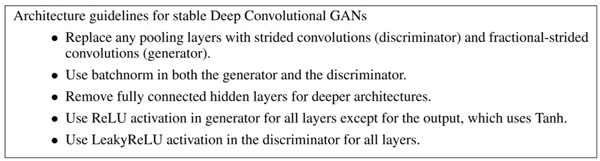
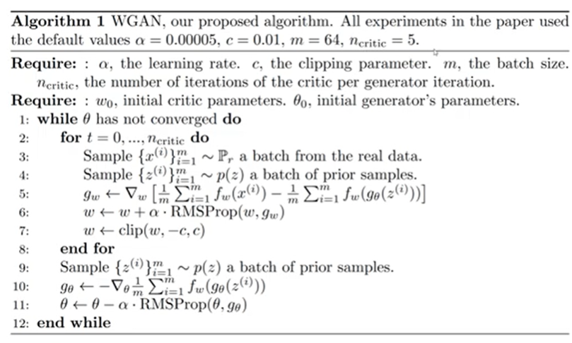

## Generative Adversial Network (GAN)

This directory consists of implemenations GANs. 

1. Simple GAN using Linear Layers: ```simpleGAN.py``` contains the implmentation details of simple GAN. MNIST dataset is used for training and tensorboard is used to visualise the training steps.

The simple GAN used linear layers and simple network. So, the results are not as expected. This can be overcome by using DCGANs. The DCGAN implemenatation includes



2. DCGAN (Deep Convolutional GAN): ```DCGAN_model.py``` and ```DCGAN_train.py``` are the implementation adn train details respectively of the DCGAN paper. The paper can be accessed [here](https://arxiv.org/abs/1511.06434)

*NOTE*: The above two models are very sensitive to hypeparameter tuning that still needs to be addressed.

3. The training stability is acheived using WGAN and its implementation details are as follows:
