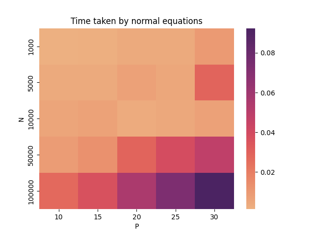
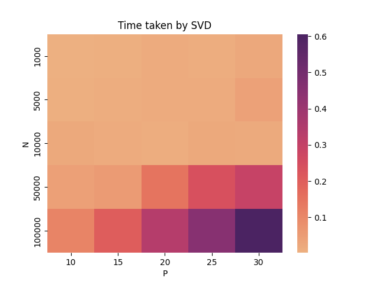

The formula for normal fit is:
$\ normal fit = (X^TX)^{-1}(X^Ty)  $

The formula for SVD is:
$\ usv_t = SVD(X) $

$\ θ = V_t^T  diag(s^{-1}) U^T  y $

# The errors obtained for each fit is as follows:

## For sklearn LinearRegression : 

    RMSE:  0.6207498618060853
    MAE:  0.5126346094502967
-------------------------
## For linear regression using normal equations : 

    RMSE:  0.6207498618060854
    MAE:  0.5126346094502968
---------------------------
## For linear regression using SVD : 

    RMSE:  0.6207498618060853
    MAE:  0.5126346094502967
---------------------------
## Time taken for each fit for over 100 times is as follows:
For different dimensions, times are as follows:

    N X D:

    30,5
    Time taken by sklearn:  0.0030342769622802735
    Time taken by normal equations:  0.00038986682891845704
    Time taken by SVD:  0.0007923293113708496

    1000,5
    Time taken by sklearn:  0.0028525519371032713
    Time taken by normal equations:  0.0011911749839782714
    Time taken by SVD:  0.0013074660301208496

    5000,10
    Time taken by sklearn:  0.006584115028381347
    Time taken by normal equations:  0.0014866900444030762
    Time taken by SVD:  0.003358006477355957

The plots for N vs P for the above three are:

```SK-learn```


```Normal```


```SVD```


References:

[SVD](https://sthalles.github.io/svd-for-regression/)
