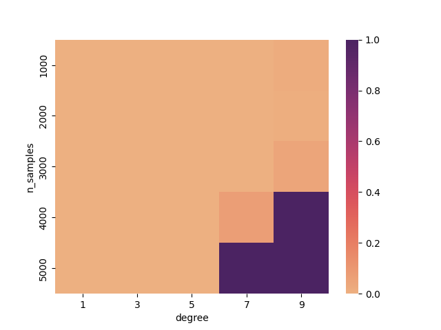

# Q5

The plot for norm(theta) vs degree is as follows:

```Dataset1:```

```python
X = np.random.rand(n_samples, 1)
y = X.squeeze()**2 + 0.1*np.random.randn(n_samples)
```


```Dataset2:```

```python
X = np.array([i*np.pi/180 for i in range(60+n_samples,300+n_samples,2)])
y = 3*X + 8 + np.random.normal(0,3,len(X))
X=X.reshape(-1,1)
```


```Dataset 3```

```python
X, y = make_regression(n_samples=n_samples, n_features=1, noise=20, random_state=45)
```


With a smaller sample size, the model may have trouble accurately estimating the coefficients, leading to larger fluctuations in the values of theta as the degree is increased.

As the degree of the polynomial is increased, the norm of theta may also increase, indicating that the model is becoming more complex and potentially overfitting the data.

With a larger sample size, the model may be better able to estimate the coefficients and may be less sensitive to changes in the degree of the polynomial.

However, even with a larger sample size, there is still a trade-off between the complexity of the model and its ability to generalize to new data. As the degree is increased, the model may become more complex and overfit the data, leading to poor performance on new data.

Overall, the relationship between theta and the degree of the polynomial will depend on the specific dataset and the balance between complexity and generalization that is desired for the model. It is important to carefully select the degree of the polynomial and the sample size to achieve the best possible performance on new data.

That's the reaspn for two plots.


A pivot for all three values is ploted and is as follows:




