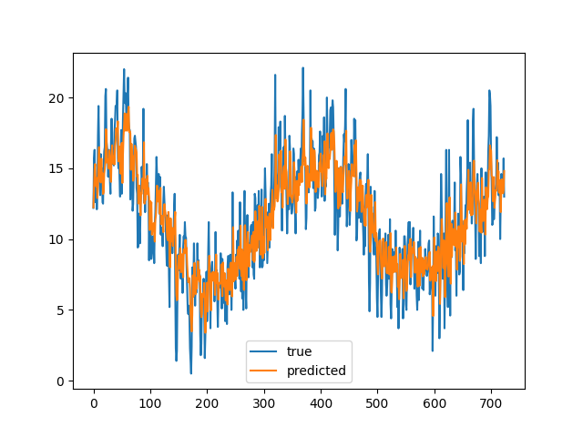

## The plot for this question is as follows:



The RMSE thus obtained is:
    ```RMSE: 2.2056299931148207```


An autoregressive (AR) model forecasts future behavior based on past behavior data. This type of analysis is used when there is a correlation between the time series values and their preceding and succeeding values.

Here the recent 30 days are trained and the next day is tested for.

Reference lags creation:
[lags](https://pandas.pydata.org/docs/reference/api/pandas.DataFrame.shift.html)