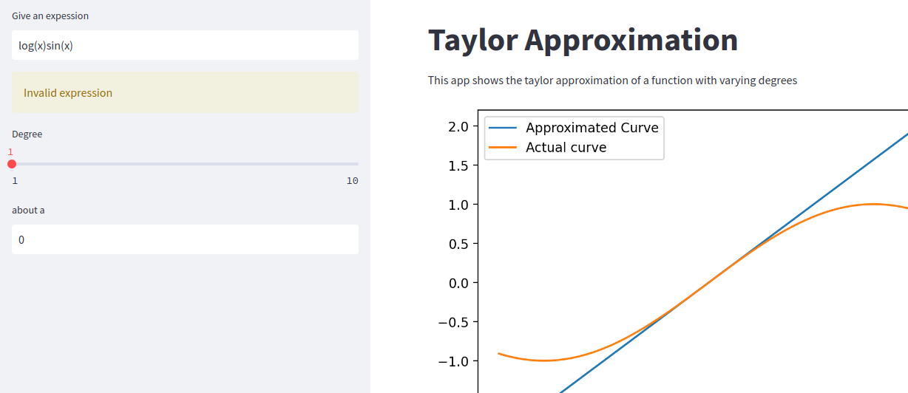
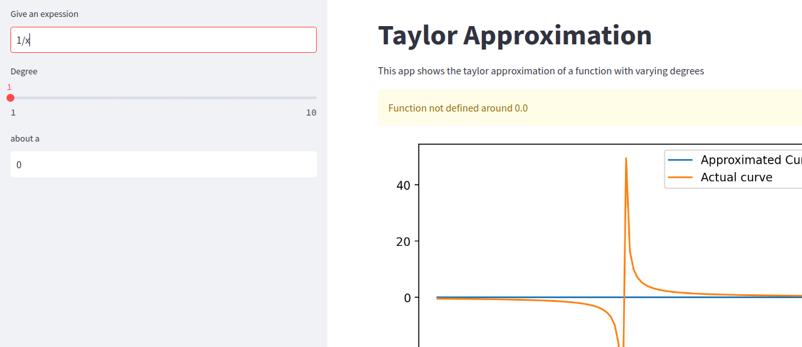
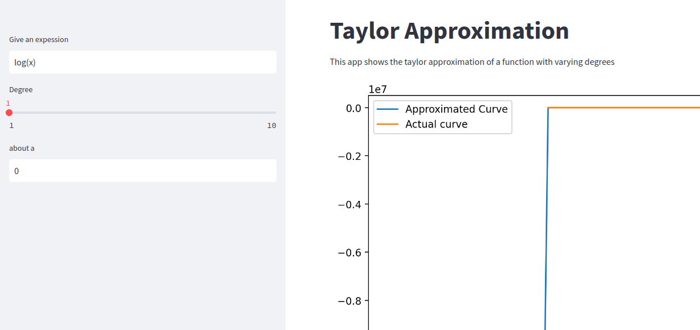

# Taylor Approximation

The following app is based on Taylor Approximation and is built using ```Streamlit```

Given a function, $n^{th}$ degree taylor approximation can be done about point ```a``` (variable).

A degree n can be chosen using slider from 1 to n. (Max value of n is 10)

The app for Taylor approximation of arbitary function about any point can be acceded [here](https://saikrishna4276-taylor-approximation-taylor-arbitaryfn-jke7ay.streamlit.app/)

The plot is also provided with two options:
1. Fixed: The plot is fixed
2. Dynamic: Interactive plot

### NOTE:
1. Make sure the expression are valid, 
    
    valid expressions: sin(x) * cos(x)
    
    Inavalid expressions: sin(x)cos(x)
    
    

2. You cannot approximate the functions which are not define about ```a```.

For Example:
    $ f(x) = 1/x $ ```at``` $ a = 0 $ is undefined or nan.
    

3. The functions which cause overflow (inf) or undeflow (-inf) are replaced with 10e+6 and 10e-6 respectively. 

Example: $log(x)$ at $a = 0$



# Valid Functions (all case-sensitive (lower))
* exponential - ```exp(x)```
* log - ```log(x)```
* ploynomial - ```x**2```  or ```x**n```
* ```1/x``` ,```1/x**n``` where x!=0
* ```sin(x)```, ```tan(x)```, ```cos(x)``` etc

```Note:``` Symbols are case-insensitive.